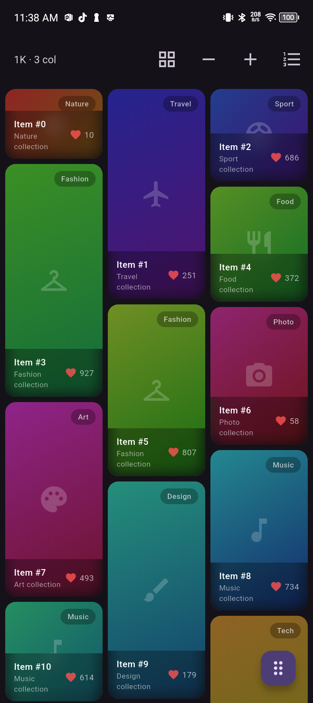

# lm_smooth

High-performance virtualized masonry views for Flutter.

`lm_smooth` is built for feeds, dashboards, and device grids where item heights are known ahead of time. It avoids runtime child measurement, precomputes item geometry, and keeps scrolling predictable for large datasets.



## Features

- Fixed-column masonry grid with uneven item heights
- Lazy item building with a custom sliver render pipeline
- Precomputed layout cache and spatial index for fast viewport queries
- Optional isolate layout computation for large item counts
- Long-press drag reorder with preview animation and edge auto-scroll
- Sectioned grids with in-scroll or pinned headers
- Scroll-state sessions for tabs/pages that need restore behavior
- Known-extent vertical and horizontal lists
- Basic virtualized table with pinned rows and columns

## When to use it

Use `lm_smooth` when:

- item heights are available from your model or can be computed cheaply
- you need a masonry feed with many items
- you want built-in drag reorder for a vertical masonry grid
- you need section headers, pinned headers, or scroll-state restore
- you want predictable scroll performance over runtime measurement flexibility

Use a runtime-measured staggered grid instead if item height depends on laying out unknown child content.

## Install

```yaml
dependencies:
  lm_smooth: ^0.1.0
```

```dart
import 'package:lm_smooth/lm_smooth.dart';
```

## Quick start

```dart
class DemoPage extends StatelessWidget {
  DemoPage({super.key});

  final items = List.generate(1000, (index) => index);

  double heightForItem(int item) => 100 + (item % 5) * 24.0;

  @override
  Widget build(BuildContext context) {
    return SmoothGrid.count(
      itemCount: items.length,
      crossAxisCount: 3,
      mainAxisSpacing: 8,
      crossAxisSpacing: 8,
      padding: const EdgeInsets.all(8),
      itemExtentBuilder: (index) => heightForItem(items[index]),
      itemBuilder: (context, index) {
        final item = items[index];
        return SmoothGridTile(
          child: Card(
            child: Center(child: Text('Item $item')),
          ),
        );
      },
    );
  }
}
```

## Migrating from `StaggeredGrid.count`

`StaggeredGrid.count(children: ...)` builds from a list of widgets and lets Flutter determine child size. `SmoothGrid` is different: it keeps performance predictable by requiring an extent for each item.

Prefer the builder API:

```dart
SmoothGrid.count(
  itemCount: devices.length,
  crossAxisCount: crossAxisCount,
  crossAxisSpacing: AppDimension.verticalAxisSpacingCard,
  mainAxisSpacing: AppDimension.horizontalAxisSpacingCard,
  itemExtentBuilder: (index) => deviceCardHeight(devices[index]),
  itemBuilder: (context, index) {
    final device = devices[index];
    return SmoothGridTile(
      key: ValueKey(device.id),
      child: DevicesGroupsItem(
        hasBlur: true,
        device: device,
      ),
    );
  },
)
```

Avoid passing a prebuilt `children` list for large collections. Builder-based usage preserves lazy construction and is the recommended path for performance.

## Drag reorder

```dart
class ReorderDemo extends StatefulWidget {
  const ReorderDemo({super.key});

  @override
  State<ReorderDemo> createState() => _ReorderDemoState();
}

class _ReorderDemoState extends State<ReorderDemo> {
  final items = List.generate(200, (index) => index);

  double heightForItem(int item) => 80 + (item % 6) * 20.0;

  @override
  Widget build(BuildContext context) {
    return SmoothGrid.count(
      itemCount: items.length,
      reorderable: true,
      crossAxisCount: 2,
      mainAxisSpacing: 8,
      crossAxisSpacing: 8,
      padding: const EdgeInsets.all(8),
      itemExtentBuilder: (index) => heightForItem(items[index]),
      itemBuilder: (context, index) {
        final item = items[index];
        return SmoothGridTile(
          key: ValueKey(item),
          child: Card(child: Center(child: Text('Item $item'))),
        );
      },
      onReorder: (oldIndex, newIndex) {
        setState(() {
          final item = items.removeAt(oldIndex);
          final insertAt = newIndex > oldIndex ? newIndex - 1 : newIndex;
          items.insert(insertAt, item);
        });
      },
    );
  }
}
```

Use stable keys when reordering stateful children.

## Sectioned grid

`SmoothSectionedGrid` renders multiple masonry sections in one scroll view. Headers can scroll normally or remain pinned.

```dart
SmoothSectionedGrid(
  sections: const [
    SmoothGridSection(id: 'today', itemCount: 40),
    SmoothGridSection(id: 'archive', itemCount: 80),
  ],
  pinnedHeaders: true,
  pinnedHeaderExtent: 56,
  crossAxisCount: 2,
  headerBuilder: (context, sectionIndex) => Text('Section $sectionIndex'),
  itemExtentBuilder: (sectionIndex, itemIndex) => 120,
  itemBuilder: (context, sectionIndex, itemIndex) {
    return SmoothGridTile(child: Text('$sectionIndex / $itemIndex'));
  },
)
```

## Sessions

Use `SmoothSessionController` when a view needs to restore scroll offset after switching tabs/pages or rebuilding the route.

```dart
final session = SmoothSessionController(id: 'devices');

SmoothGrid.count(
  sessionController: session,
  itemCount: devices.length,
  crossAxisCount: 2,
  itemExtentBuilder: (index) => deviceCardHeight(devices[index]),
  itemBuilder: (context, index) => DeviceCard(device: devices[index]),
)
```

Dispose the controller when the owning widget is disposed.

## API overview

### SmoothGrid

Primary masonry grid widget.

Common parameters:

- `itemCount`
- `itemBuilder`
- `itemExtentBuilder` via `SmoothGrid.count`
- `delegate` for custom grid configuration
- `controller`, `physics`, `cacheExtent`
- `reorderable`, `onReorder`, `reorderConfig`
- `sessionController`

### SmoothSectionedGrid

Grouped masonry grid with section headers.

- `sections`
- `headerBuilder`
- `itemBuilder`
- `itemExtentBuilder`
- `pinnedHeaders`
- `pinnedHeaderExtent`

### SmoothList

Known-extent `ListView` convenience wrapper with vertical and horizontal support.

### SmoothTable

Early data-grid style widget for large row/column datasets. It supports vertical row virtualization, horizontal cell culling, and pinned rows/columns.

## Performance notes

- Keep `itemExtentBuilder` cheap and deterministic.
- Precompute heights from model data when possible.
- Do not measure widgets inside `itemExtentBuilder`.
- Prefer builder APIs over prebuilt child lists.
- Use stable keys for reorderable items.
- Tune `cacheExtent` for your item complexity and target devices.

## Current limitations

- Item extents must be known ahead of time.
- Reorder is focused on vertical `SmoothGrid`.
- `SmoothSectionedGrid` does not yet support cross-section reorder.
- Horizontal masonry grid/reorder is not yet supported.
- `SmoothTable` is intentionally small and focused; it is not a full spreadsheet component.

## Example app

The example app contains focused screens for:

- large masonry grid and reorder
- pinned section headers
- horizontal known-extent list
- vertical known-extent list
- pinned table rows/columns

Run it with:

```bash
cd example
flutter run
```

## Benchmarks

Benchmarks live in `benchmark/` and can be run with:

```bash
flutter test benchmark/layout_benchmark_test.dart --reporter expanded
```

## License

MIT. See [LICENSE](LICENSE).
